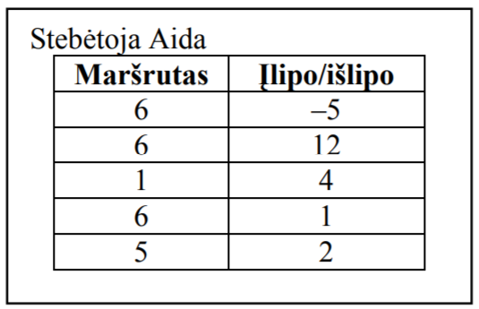
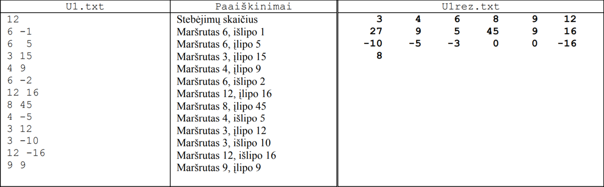

# Išpręskime VBE IT 2008 metų užduotį „Tyrimai“


Priešais Jus yra Valstybės brandos egzamino Informacinių technologijų vienos dalies simuliacija. Taigi norint patirti egzamino džiaugsmą, turėtumėte viską padaryti savarankiškai.
Egzamino metu negalima naudotis internetu, todėl ir Jums patariu to nedaryti.
Jeigu natūraliai reikės pagalbos (sintaksei prisiminti ir pan.), tada galite google'intis, BET visus šaltinius, kuriuos aplankėte, prašau, įdėkite į savo programą į komentarą viršuje.

Pati užduotis yra pateikta skyriuje **"IT egzamino užduotis"**. Egzamine reikės patiems suprasti užduotį... ją skaitant... jokių vaizdo medžiagų...
Tačiau jeigu matysite, jog sunku savarankiškai suprasti užduotį, tada galite užklausti manęs.





# IV. Programavimo praktinė užduotis

## 1 užduotis. Tyrimai 

Ukmergėje yra m (1 ≤ m ≤ 100) autobusų maršrutų. Norėdami išsiaiškinti, kiek autobusų reikia kiekvienam maršrutui, mokiniai skaičiavo, kiek pervežama
keleivių. Stebėtoju vienoje stotelėje dirbo tik vienas mokinys. Mokiniai stebėjo (dirbo) visose miesto stotelėse, išskyrus paskutinę kiekvieno maršruto stotelę,
kurioje išlipa visi dar važiavę keleiviai. Buvo registruojami visų maršrutų keleiviai. Savo stebėjimo rezultatus kiekvienas mokinys rašė duomenų lape:
maršruto numerį ir kiek įlipo keleivių (teigiamas skaičius) arba/ir maršruto numerį ir kiek išlipo keleivių (neigiamas skaičius). Atvejai, kai stotelėje nebuvo
įlipusių ir/arba išlipusių keleivių, duomenų lape nebuvo registruojami. (Žiūrėkite Aidos duomenų lapo pavyzdį).

**Duomenys.** Visi stebėjimų duomenys surašyti tekstiniame faile *U1.txt*. Pirmoje eilutėje yra visų mokinių surinktų
duomenų skaičius *n (n ≥ 1)*. Tolesnėse n eilučių yra po du skaičius: maršruto numeris ir keleivių skaičius
(teigiamas, jeigu įlipo, neigiamas – jeigu išlipo).

**Parašykite programą**, kuri spausdintų faile *U1rez.txt* mokinių stebėjimų rezultatus.
1. Pirmoje eilutėje spausdintų maršrutų, kuriais važiavo bent vienas keleivis, numerius didėjimo tvarka.
1. Antroje eilutėje spausdintų, kiek keleivių vežta kiekvienu maršrutu maršrutų numerių didėjimo tvarka.
1. Trečioje eilutėje spausdintų kiek kiekvieno maršruto autobusų keleivių išlipo visose tarpinėse stotelėse arba nulį, jeigu nė vienas keleivis iš to maršruto autobusų neišlipo. Spausdintų maršrutų numerių didėjimo tvarka.
1. Ketvirtoje eilutėje spausdintų maršruto, kurio visais autobusais vežta daugiausia keleivių, numerį. Jeigu tokie
maršrutai yra keli, tai spausdintų mažiausią numerį.
Kiekvienam skaičiui spausdinti skirtos 6 pozicijos.

**Pastaba.** Vežtų maršrutu keleivių skaičius yra lygus įlipusių į visus to maršruto autobusus keleivių skaičių sumai.

**Nurodymai:**
- Rašydami programą naudokite tik vienmačius sveikųjų skaičių masyvus.
- Programoje neturi būti sakinių, skirtų darbui su ekranu.




Norint pasinaudoti check50 ar submit50, reikia aplankyti šią nuorodą:
> https://submit.cs50.io/invites/1d1aa7b05d25492085fb7518135a245d

Norint pasitikrinti ar programa korektiškai veikia, rekomenduojama tą padaryti be check50 ir žiūrėti, kokius gaunate atsakymus U1rez.txt faile. Bet jeigu labai norite, yra paprastas patikrinimas:
> check50 Olegasm/VBE/IT/2008

Jeigu jaučiate, jog sėkmingai padarėte, tada prašau priduokite savo programą, parašius konsolėje:
> submit50 Olegasm/VBE/IT/2008
Kaip matote taškai už korektiškumą automatiškai neparašuomi, bet galite patys suskaičiuoti :D
 
