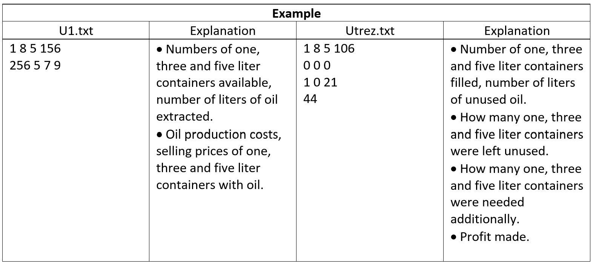

# This task is from oficial IT exam for LT pupils called „Aliejus“ (english Oil)



# IV. Practical programming 

## Task: Oil 

The farmer pours the extracted oil into the available one-liter, three-liter and five-liter bottles. First of all
the oil is poured into five-liter containers. Then, if necessary, to three - liter containers, and finally, if necessary, to
one liter of dishes. There must be no incompletely filled container. There may be enough, too much, to pour the oil into the bowl
or too little.

Write a program that calculates:
  * how many available one, three and five liter containers were filled and how many liters of oil remained unfilled;
  * how many additional containers of one, three and five liters should be purchased in order to fill the whole
the remaining oil;
  * what will be the profit from selling all the containers with oil; the prices of all the dishes are included in the oil
production costs.

## Initial data

The data is presented in a text file U1.txt.
The data file contains:
* the first line contains four numbers: the numbers of one, three and five liter containers available
n1, n3, n 5 (1 ≤ n1, n 3, n 5 ≤ 35) and number of liters of oil extracted
k (1 ≤ k ≤ 1000).
* the second line contains four figures: the cost of producing the oil, one, three and five liter containers
with oil selling prices.
Numbers are separated by a single space character. All numbers are integers.

## Results

Provide the results in a text file U1rez.txt.
* In the first line, enter the number of one, three and five liter containers the farmer has and
how many liters of oil remained unfilled. If any of the containers are not used, write zero. If
all the oil was bottled, write that there were zero liters of oil left.
* On the second line, enter how many containers of one, three and five liters are left unused. If all
containers of the appropriate capacity have been used, write zero.
* In the third line, enter how many additional containers of one, three and five liters capacity should be purchased,
to dispense any remaining oil. If there is no oil left, enter three zeros.
* On the fourth line, enter the profit you will make from selling all the containers with oil. If profit
will not, write zero. If there will be a loss, write down what (negative number).

## Instructions

* Create and write a program that counts how many containers and
how many liters of oil remained unfilled.
* Do not use sentences for working with the screen in the program.




if you want to use check50 and/or submit50, you should visit this link:
> https://submit.cs50.io/invites/1d1aa7b05d25492085fb7518135a245d

Execute this line to check correctness of the program:
> check50 Olegasm/VBE/IT/2019/LCC

Execute this line to submit your code:
> submit50 Olegasm/VBE/IT/2019/LCC
 
