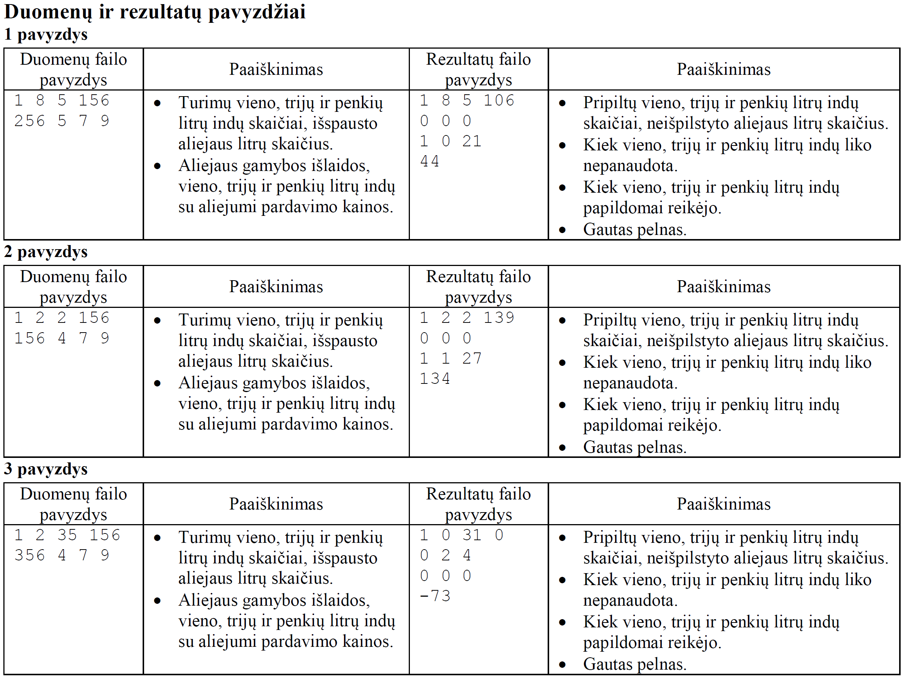

# Išpręskime VBE IT 2019 metų užduotį „Aliejus“


Priešais Jus yra Valstybės brandos egzamino Informacinių technologijų vienos dalies simuliacija. Taigi norint patirti egzamino džiaugsmą, turėtumėte viską padaryti savarankiškai.
Egzamino metu negalima naudotis internetu, todėl ir Jums patariu to nedaryti.
Jeigu natūraliai reikės pagalbos (sintaksei prisiminti ir pan.), tada galite google'intis, BET visus šaltinius, kuriuos aplankėte, prašau, įdėkite į savo programą į komentarą viršuje.

Pati užduotis yra pateikta skyriuje **"IT egzamino užduotis"**. Egzamine reikės patiems suprasti užduotį... ją skaitant... jokių vaizdo medžiagų...
Tačiau jeigu matysite, jog sunku savarankiškai suprasti užduotį, tada galite pažiūrėti walkthrough skyriuje **"Užduoties suvokimas"**.
Skyriuje **"Algoritminis mąstymas"** užduoties atlikimas yra šiek tiek išskaidytas į tarpinius žingsnius, irgi nepatarčiau naudoti :D





# IV. Programavimo praktinės užduotys

## 1 užduotis. Aliejus 

Ūkininkas išspaustą aliejų išpilsto į turimus vieno litro, trijų litrų ir penkių litrų indus. Pirmiausia
aliejus pilamas į penkių litrų indus. Po to, jeigu reikia, – į trijų litrų indus, galiausiai, jeigu reikia, – į
vieno litro indus. Nepilnai užpildyto indo neturi būti. Indų aliejui pilstyti gali būti pakankamai, per daug
arba per mažai.

Parašykite programą, kuri suskaičiuotų:
  * kiek buvo pripilta turimų vieno, trijų ir penkių litrų indų ir kiek litrų aliejaus liko neišpilstyta;
  * kiek vieno, trijų ir penkių litrų indų papildomai reikėtų įsigyti, norint tuo pačiu būdu išpilstyti visą
likusį aliejų;
  * koks bus gautas pelnas, pardavus visus indus su aliejumi; visų indų kainos įskaičiuotos į aliejaus
gamybos išlaidas.

## Pradiniai duomenys

Duomenys pateikiami tekstiniame faile U1.txt.
Duomenų faile įrašyta:
* pirmoje eilutėje užrašyti keturi skaičiai: turimų vieno, trijų ir penkių litrų indų skaičiai
n1, n3, n 5 ( 1 ≤ n1, n 3 , n 5 ≤ 35 ) ir išspausto aliejaus litrų skaičius
k ( 1 ≤ k ≤ 1000 ).
* antroje eilutėje užrašyti keturi skaičiai: aliejaus gamybos išlaidos, vieno, trijų ir penkių litrų indų
su aliejumi pardavimo kainos.
Skaičiai atskirti vienu tarpo simboliu. Visi skaičiai yra sveikieji.

## Rezultatai

Rezultatus pateikite tekstiniame faile U1rez.txt.
* Pirmoje eilutėje įrašykite, kiek buvo pripilta ūkininko turimų vieno, trijų ir penkių litrų indų ir
kiek litrų aliejaus liko neišpilstyta. Jeigu kurios nors talpos indai nepanaudoti, rašykite nulį. Jeigu
visas aliejus buvo išpilstytas, rašykite, kad liko nulis litrų aliejaus.
* Antroje eilutėje įrašykite, kiek vieno, trijų ir penkių litrų talpos indų liko nepanaudota. Jeigu visi
atitinkamos talpos indai buvo panaudoti, rašykite nulį.
* Trečioje eilutėje įrašykite, kiek papildomai vieno, trijų ir penkių litrų talpos indų reikėtų įsigyti,
norint išpilstyti visą likusį aliejų. Jeigu aliejaus neliko, įrašykite tris nulius.
* Ketvirtoje eilutėje įrašykite, koks bus gautas pelnas, pardavus visus indus su aliejumi. Jeigu pelno
nebus, rašykite nulį. Jeigu bus nuostolis, užrašykite, koks (neigiamuoju skaičiumi).

## Nurodymai

* Sukurkite ir parašykite funkciją1, kuri suskaičiuotų, kiek buvo panaudota nurodytos talpos indų ir
kiek litrų aliejaus liko neišpilstyta.
* Programoje nenaudokite sakinių, skirtų darbui su ekranu.

1Pascal programavimo kalboje turi būti procedūra.













1. Sukompiliuokite savo programą.
1. Paleiskite programą.
1. Parašykite koda:
    1. Nuskaitykite informaciją iš failo U1.txt.
    1. Atspausdinkite nuskaitytą informaciją į failą U1rez.txt.
    1. Nuskaitykite indų kiekį, aliejų kiekį.
    1. Apskaičiuokite kiek esamų indų galite pripilti, turing tam tikrą aliejį kiekį.
    1. Įrašykite į failą U1rez.txt, kiek ir kokių indų panaudojame aliejui išpilstyti bei kiek aliejaus liko.
    1.  ir t.t.
 



 


Norint pasinaudoti check50 ar submit50, reikia aplankyti šią nuorodą:
> https://submit.cs50.io/invites/1d1aa7b05d25492085fb7518135a245d

Norint pasitikrinti ar programa korektiškai veikia, rekomenduojama tą padaryti be check50 ir žiūrėti, kokius gaunate atsakymus U1rez.txt faile. Bet jeigu labai norite, yra paprastas patikrinimas:
> check50 Olegasm/VBE/IT/2019/cpp

Jeigu jaučiate, jog sėkmingai padarėte, tada prašau priduokite savo programą, parašius konsolėje:
> submit50 Olegasm/VBE/IT/2019/cpp
Kaip matote taškai už korektiškumą automatiškai neparašuomi, bet galite patys suskaičiuoti :D
 

